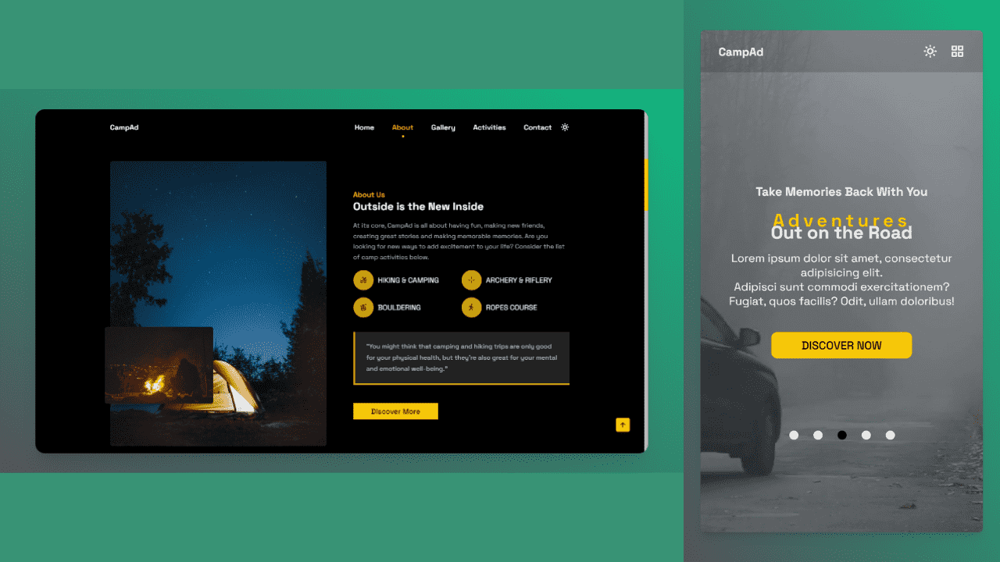

# A Fully Responsive Camp Adventure Website
> This is a basic static website about camp adventure showcasing my Frond-End skills.
## Live demo [_here_](https://campad.netlify.app/).

## Table of Contents
* [Overwiew](#overview)
* [Preview](#preview)
* [Tools Used](#tools-used)
* [Built With](#built-with)

### Overview
- A Responsive Camp Adventure Website
- Developed using Mobile First Approach.
- It is compatible with all devices.
- It has darkmode/lightmode features.
- SEO optimized
- Contains animations when scrolling.

### Preview

### Tools Used
- Icons: https://boxicons.com/
- Videos: https://www.pexels.com/
- Videos: https://coverr.co/

### Built With
- HTML5
- CSS3
- Javascript
- CSS Flexbox
- CSS Grid
